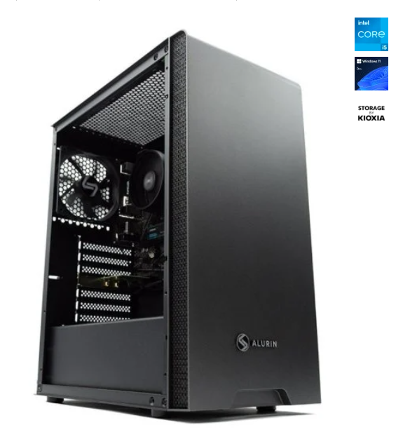
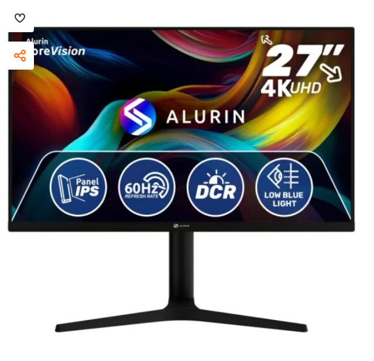
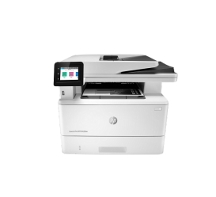
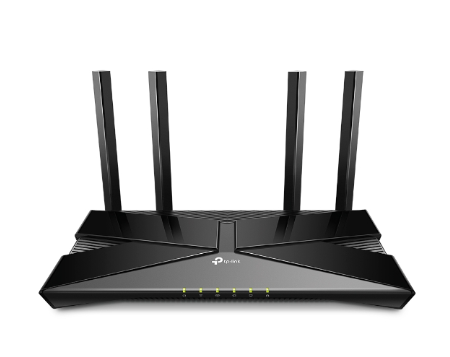

# 📦 Inventari d’Equips

## 🖥️ Ordinadors

**PcCom Work Intel Core i5-12400 / 32GB / 2TB SSD + Windows 11 Pro**  
**Quantitat:** 4  
**Consum:** 500W/unitat  
**Funció:** Imprescindibles per garantir que els treballadors puguin desar la feina i apagar correctament els equips en cas de tall elèctric.

---

## 🖥️ Monitors

**Alurin CoreVision 27" IPS 4K Freesync**
**Quantitat:** 4  
**Consum:** 48W/unitat  
**Funció:** Imprescindibles per el mateix cas que els ordinadors ja que sensa els monitors seria practicament imposible poder guardar la informació.

---

## 🖨️ Impressora

**HP LaserJet Pro MFP** alt consum i la no essencialitat en cas de tall elèctric fan que no sigui prioritària.
**Quantitat:** 1  
**Consum:** 510W/unitat  
**Funció:** No la connectarem al SAI. Aquest tipus de màquina consumeix molta energia i no és essencial en cas de tall elèctric. La prioritat és mantenir els ordinadors i el router.

---

## 🌐 Router

**TP-Link Archer AX53**
**Quantitat:** 1  
**Consum:** 12W/unitat  
**Funció:** És necessari perquè dona connexió a tots els ordinadors i permet continuar treballant (o almenys enviar/guardar dades al núvol) durant una estona.

---

## ⚡ Càlcul de Potència Total

(500W x 4) + (48W x 4) + 12W = 2204W
2204W ÷ 0.7 (factor de potència) ≈ 3149 VA

---

## ⏱️ Determinació de l’Autonomia

Un SAI amb una autonomia de 10 a 20 minuts seria suficient per poder guardar tots els treballs importants.
Es recomana buscar els 20 minuts per si hi ha algun treball molt pesat o una acumulació de treballs per guardar bastant gran.

---

## 🔍 Recerca de Models de SAI

- Phasak Protekt PH-7631 3160VA SAI Rack
- Salicru SLC-5000-TWIN RT3
- Salicru SLC Twin RT2 SAI On-line 3000 VA

---

## ✅ Recomanació

Empresa: TecnoGestió S.L.
Model Recomanat: Phasak Protekt PH-7631 (Rack)

🔧 Raons:

Adequació de potència: 3160 VA / 2100 W, suficient per cobrir les necessitats dels 4 ordinadors, monitors i el router.
Autonomia: Ofereix una autonomia estimada de 10 a 15 minuts, suficient per desar la feina i apagar els equips de manera segura en cas de tall elèctric.
Característiques tècniques: Ona sinusoidal pura, regulador automàtic de voltatge (AVR), múltiples sortides, pantalla LCD i comunicació RS-232 i USB.
Format: El disseny en rack 2U és ideal per a entorns amb espai limitat.
