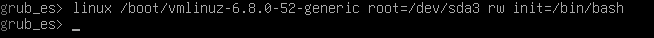
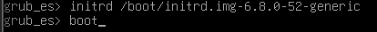

# Seguretat Lògica: recuperant accés a sistemes
---

## Pas 1: Creació de la maquina virtual 

Per a aquesta maquina haurem de ficar una memoria base de **8 GB i 2 processadors**, i no ficar cap disc ja que utilitzarem un disc amb una iso ja creada. Ara anirem a la opció de **"Hard disk"**
habilitat la opció de **"Use an existing virtual hard disk file"** i seleccionarem el disc amb la iso, i ja ho tindriem llest per arrancar la maquina.

---

## Pas 2: Canvi de contrasenya amb GRUB

Al entrar a la maquina trobarem que no sabem la contrasenya a si que tindrem que canviar-la, per poder fer aixo necesitarem entrar al grub, i per entrar al grub el primer que farem sera reiniciar la maquina mentres prement la tecla escape d'aquesta manera entrarem al grub i un cop a dins del grub utilitzarem les seguents comandes per poder entrar en modo root:

**1 - linux /boot/vmlinuz-6.8.0-52-generic root=/dev/sda3 rw init=/bin/bash**

**2 - initrd /boot/initrd.img-6.8.0-52-generic**

**3 - boot**

despres de fer servir aquestas comendes ja estarem en mode root, un cop a dins nomes tindrem que fer un "passwd miquel" i ja podrem canviar la contraseña

Quant ja tinguem la contrasenya canviada reiniciarem la maquina i introduirem la contrasenya nova per poder entrar al usuari, i un cop a dins començem amb la protecció del GRUB.

---

## Pas 3: Proteccio del GRUB basica

Ara començem amb la proteccio basica del GRUB, primer crearem una contrasenya per el GRUB, pero visualment estara encripatada, pero poder fer aixo utilitzarem la comanda **"grub-mkpasswd-pbkdf2"** un cop utilitzada ens demanara una contrasenya i que la repitem, i ens donara la contrasenya encriptada en hash.

Aquest hash el copiarem, i seguidament entrarem al ficher **"sudo nano /etc/grub.d/40_custom"** un cop a dins baixarem al final i introduirem les seguents lineas de text:
set superusers="root"
password_pbkdf2 root (enganchar el hash anteriorment copiat)

Un cop fet tot aixo guardem els canvis amb **"control + o" "enter" "control + x"**, i un cop fora guardarem tots el canvis del que hem fet al GRUB amb la comanda **"sudo update-grub"**.

I amb aixo ja tindriam la proteccio basica del GRUB, fent que quant reinicias la maquina, sempre et demani el root + contrasenya, tan com per poder entrar al GRUB, com per una arrencada de sistema normal, aquest ultim pot arribar ser un inconvenient ja que aixo pot ser que no l'hi agradi al client.

---

## Pas 4: Proteccio avançada del GRUB 

Un cop tenim la protecció bàsica del GRUB configurada, el següent pas és fer que el sistema pugui arrencar normalment sense demanar contrasenya, però que només es necessiti usuari i contrasenya per editar o accedir a opcions avançades del GRUB.

Primer, obrirem el fitxer /etc/grub.d/10_linux, que és el responsable de generar les entrades del menú del GRUB.

Ens desplacem pel fitxer (és llarg, té més de 400 línies) fins trobar les següents línies:
Aquestas lineas les podem trobar facilment fent un **control + w**, aquesta combinació et obrira un cercador de paraules, i nomes introduint la paraula **menuentry** ens portara directament on volem arribar.
A cada una de les dues línies anteriors, ens situem després del paràmetre ${CLASS} i afegim la comanda **"--unrestricted"**:

D’aquesta manera indiquem que aquestes entrades es poden executar sense contrasenya, però que la resta d’opcions del GRUB (com editar, accedir a la línia de comandes o veure altres kernels) continuaran protegides.
Després de fer els canvis, guardem el fitxer amb **control + o, enter, control + x**
I regenerem la configuració del GRUB amb un **sudo update-grub**:

Finalment, reiniciem la màquina perquè s’apliquin els canvis.

### Resultat final
El sistema arrenca automàticament sense demanar contrasenya.
Si intentes editar les opcions del GRUB, accedir a la consola o veure els modes avançats, et demanarà usuari i contrasenya.
Això ofereix una protecció equilibrada, ja que evita modificacions no autoritzades al GRUB però no incomoda l’usuari en l’arrencada normal.

## Explicacio de les comandes

---

### 1. linux /boot/vmlinuz-6.8.0-52-generic root=/dev/sda3 rw init=/bin/bash

Carrega el nucli de Linux i inicia una sessió Bash com a root, muntant la partició arrel /dev/sda3 en mode lectura-escriptura.

### 2. initrd /boot/initrd.img-6.8.0-52-generic

Carrega la imatge initrd, que conté mòduls i fitxers necessaris per arrencar el sistema.

### 3. boot

Inicia l’arrencada del sistema amb el nucli i la configuració carregada.

### 4. passwd miquel

Permet canviar la contrasenya de l’usuari miquel (o qualsevol altre usuari).

### 5. grub-mkpasswd-pbkdf2

Genera una contrasenya encriptada (hash PBKDF2) per protegir el menú del GRUB.

### 6. sudo nano /etc/grub.d/40_custom

Obre el fitxer de configuració personalitzada del GRUB amb Nano per afegir usuari i contrasenya.

### 7. set superusers="root"

Defineix l’usuari root com a administrador del GRUB.

### 8. password_pbkdf2 root <hash>

Associa la contrasenya encriptada (hash) a l’usuari root del GRUB.

### 9. Ctrl + O, Enter, Ctrl + X

Comandes de Nano per guardar i sortir del fitxer.

### 10. sudo update-grub

Actualitza i regenera la configuració del GRUB aplicant tots els canvis fets.

### 11. Ctrl + W

Cerca una paraula dins Nano, útil per trobar línies concretes com menuentry.

### 12. --unrestricted

Permet que una entrada del GRUB s’executi sense contrasenya, mantenint protegides les opcions d’edició i avançades.

### 13. reboot

Reinicia el sistema per aplicar i comprovar els canvis.

---

[Torna a la T03](README.md)

